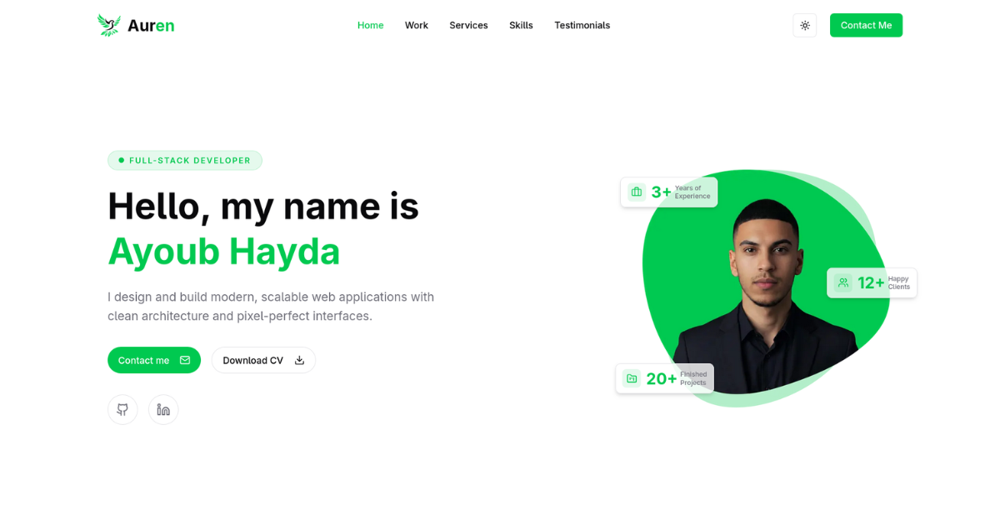

<p align="center">
  
</p>

<h1 align="center">Auren — Personal Portfolio</h1>

<p align="center">
  <strong>A modern, full-stack personal portfolio built with Next.js 15 — showcasing projects, services, skills, and testimonials with a sleek, theme-aware design and an admin dashboard for content management.</strong>
</p>

<p align="center">
  <a href="https://ayoub-hayda.vercel.app" target="_blank"><strong>🌐 Live Demo</strong></a> &nbsp;&middot;&nbsp;
  <a href="https://github.com/ayoubhayda"><strong>👤 GitHub Profile</strong></a>
</p>

<p align="center">
  
  
  
  
  
</p>

---

## ✨ Overview

**Auren** is a premium developer portfolio designed to leave a lasting impression. It features smooth animations, responsive layouts across all breakpoints, light/dark theme support, and a full-featured admin dashboard — all powered by a modern full-stack architecture.

## 🖼️ Key Sections

| Section | Description |
|---|---|
| **Hero** | Animated landing section with personal intro, statistics, and call-to-action |
| **My Work** | Project showcase with thumbnails, tech stacks, live demos, and GitHub links |
| **Services** | Detailed service offerings with elegant card designs |
| **Skills** | Technical skills display with categorized proficiency levels |
| **Testimonials** | Client testimonials carousel with social proof |
| **Contact** | Contact form with email integration via Resend |

## 🛠️ Tech Stack

### Frontend
- **[Next.js 15](https://nextjs.org/)** — React framework with App Router & Turbopack
- **[TypeScript](https://www.typescriptlang.org/)** — Type-safe JavaScript
- **[Tailwind CSS v4](https://tailwindcss.com/)** — Utility-first CSS framework
- **[Framer Motion](https://www.framer.com/motion/)** — Declarative animations & micro-interactions
- **[Radix UI](https://www.radix-ui.com/)** — Accessible, unstyled UI primitives
- **[Lucide React](https://lucide.dev/)** — Beautiful icon library

### Backend & Data
- **[Prisma](https://www.prisma.io/)** — Type-safe ORM for PostgreSQL
- **[PostgreSQL](https://www.postgresql.org/)** (via [Neon](https://neon.tech/)) — Serverless database
- **[NextAuth.js v5](https://authjs.dev/)** — Authentication with role-based access (Admin/User)
- **[Resend](https://resend.com/)** — Transactional email delivery
- **[UploadThing](https://uploadthing.com/)** — File uploads for project images & screenshots

### Tooling
- **[pnpm](https://pnpm.io/)** — Fast, disk-efficient package manager
- **[ESLint](https://eslint.org/)** — Code linting & quality
- **[Vercel](https://vercel.com/)** — Deployment & hosting

## 📁 Project Structure

```
src/
├── app/
│   ├── (mainLayout)/          # Public-facing pages (home, projects, services)
│   ├── (dashboardLayout)/     # Admin dashboard & project management
│   ├── api/                   # API routes (auth, contact, uploadthing)
│   ├── login/                 # Authentication page
│   ├── layout.tsx             # Root layout with theme provider
│   └── globals.css            # Global styles & design tokens
├── components/
│   ├── sections/              # Page sections (Hero, Services, Skills, etc.)
│   ├── general/               # Shared components (Navbar, Footer, etc.)
│   ├── forms/                 # Form components
│   ├── ui/                    # Radix-based UI primitives
│   ├── richTextEditor/        # Tiptap rich text editor
│   └── theme/                 # Theme toggle (light/dark/system)
├── assets/                    # Static assets (images, SVGs, logos)
├── constants/                 # App-wide constants & data
├── hooks/                     # Custom React hooks
├── lib/                       # Utility libraries (Prisma client, auth config)
├── types/                     # TypeScript type definitions
└── utils/                     # Helper functions
```

## ⚡ Getting Started

### Prerequisites

- **Node.js** ≥ 18
- **pnpm** ≥ 8
- **PostgreSQL** database (or a [Neon](https://neon.tech/) account)

### 1. Clone the Repository

```bash
git clone https://github.com/ayoubhayda/auren-portfolio.git
cd auren-portfolio
```

### 2. Install Dependencies

```bash
pnpm install
```

### 3. Configure Environment Variables

Create a `.env` file in the project root:

```env
# Database
DATABASE_URL="postgresql://..."

# Authentication (NextAuth)
AUTH_SECRET="your-secret"
AUTH_GITHUB_ID="..."
AUTH_GITHUB_SECRET="..."

# File Uploads (UploadThing)
UPLOADTHING_TOKEN="..."

# Email (Resend)
RESEND_API_KEY="..."
```

### 4. Set Up the Database

```bash
npx prisma db push
npx prisma generate
```

### 5. Run the Dev Server

```bash
pnpm dev
```

Open **[http://localhost:3000](http://localhost:3000)** to view the portfolio.

## 🔐 Admin Dashboard

The portfolio includes a protected admin dashboard for managing content:

- **Add / Edit / Delete Projects** — Full CRUD with rich text descriptions
- **Upload Screenshots** — Drag-and-drop image uploads via UploadThing
- **Role-Based Access** — Only users with the `ADMIN` role can access the dashboard

Access the dashboard at `/dashboard` after signing in with an admin account.

## 🚀 Deployment

This project is optimized for deployment on **[Vercel](https://vercel.com/)**:

1. Push your code to GitHub
2. Import the repository on Vercel
3. Add your environment variables in the Vercel dashboard
4. Deploy — Vercel handles everything else automatically

## 📬 Contact

**Ayoub Hayda** — Full Stack Developer

- 🌐 Portfolio: [ayoub-hayda.vercel.app](https://ayoub-hayda.vercel.app)
- 🐙 GitHub: [@ayoubhayda](https://github.com/ayoubhayda)

---

<p align="center">
  Built with ❤️ using Next.js, TypeScript & Tailwind CSS
</p>
